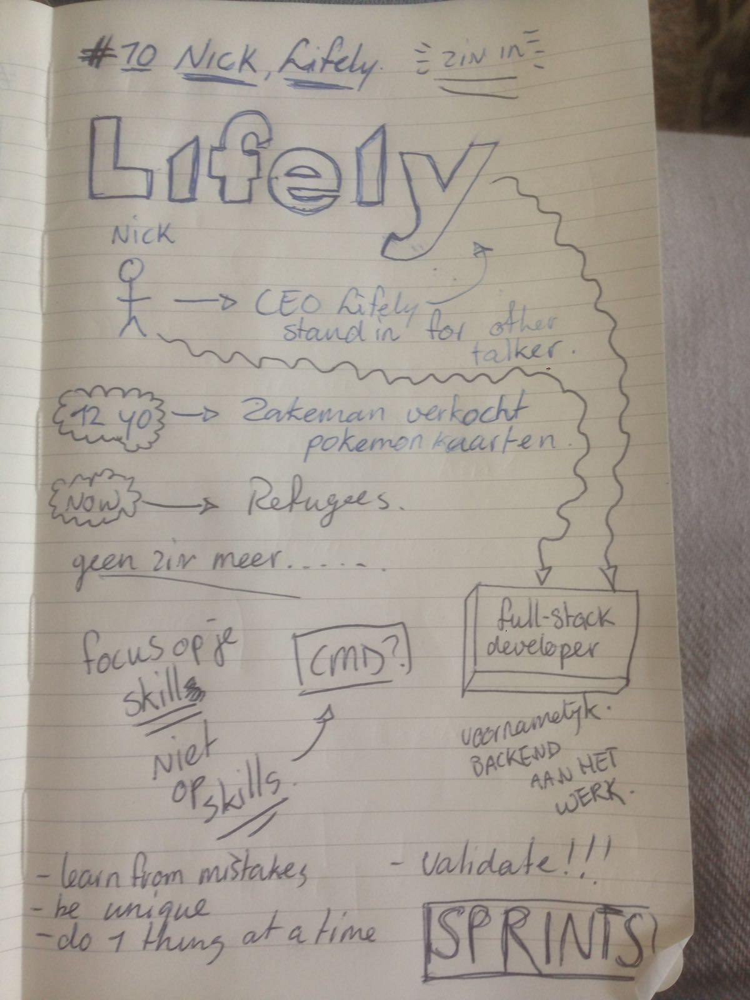
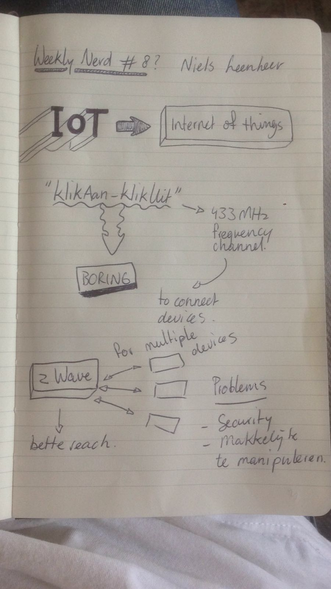
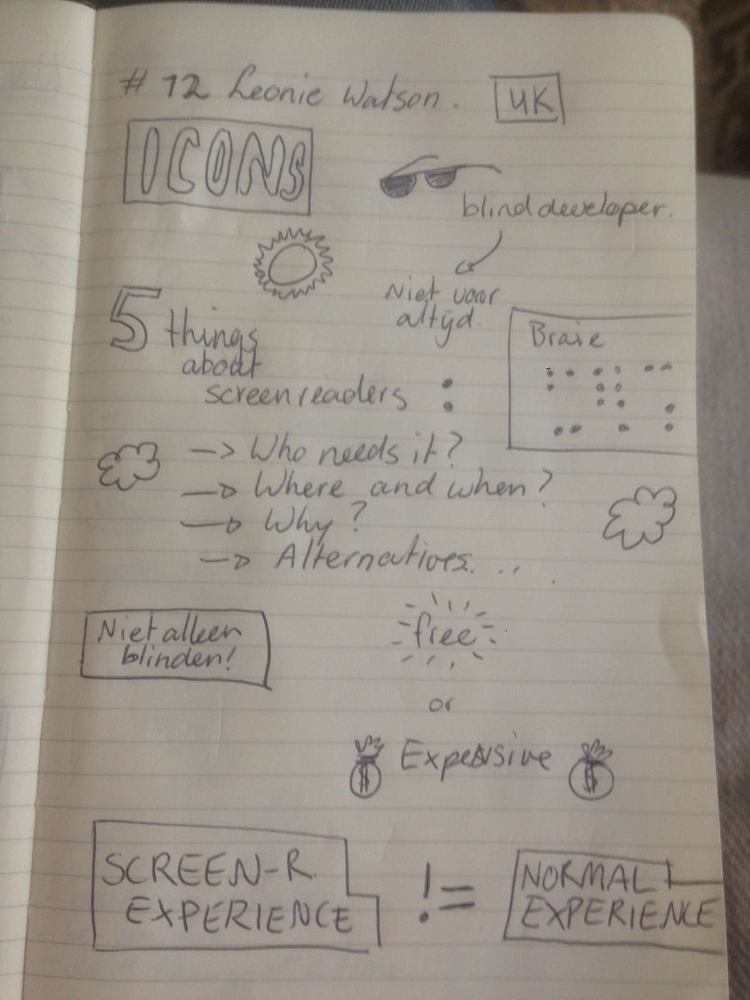

# Weekly Nerd 1

Steven Hay, werkt bij CataWiki.

> gewerkt aan de webrichtlijnen (met name toegankelijkheid)
> Cinnamon

Graphic Design gestudeerd.

W3C standards
> accesibility guidelines
  - blinden
  - slecht horende etc.

IE6 werd veel gebruikt.

TNO did the research

For us important:

- What are the guidelines you want to think about
- Set the guideline, then use it!
- Be consistent
- Document
- Part of your styleguide
- Try out, test test test!

Make Hypothesis > Test it

Problems between designers and Developers = communication

> Book: Responsive Design Workflow

Darkpatterns: fustrating patterns

**Next big challenge**

- Not done on Responsive Design
- What are the importent stufff to learn for a developer
- Learn the core

-------

# Weekly Nerd 3

## Choosing the Web's future. By Peter Paul Koch

PPk maakt zich zorgen, hierbij zijn er vier problemen waar hij het specifiek overheeft:

1. Te veel willen lijken op native apps
2. Te veel features, die erbij komen
3. Oneindig veel tools/libs/frameworks
4. Nieuw gangers overdenken dat het maar een platform is

1. Native apps

10 jaar geleden (voor responsive design), gebruikte we het web om apps te emuleren in de browser. Een voorbeeld hiervan is Google docs. (Desktop app)

Dit creeerde verwachtingen.. Toen kwam de Iphone, de eerste iphone kon geen native apps gebruiken, de oplossing die hiervoor gegeven werd was: Maak gebruik van alleen webapps. Maar het probleem was dat het toch lastig was en nogal omslachtig om native apps te simuleren op een webomgeving.

Android = Tegen het web

Chrome vs. Android (= Google issues)

2. To much features

Elk jaar komen er weer idioot veel featurs bij in browsers. Deze zijn vaak niet inlijn met elkaar waardoor er Polyfills nodig zijn JS (TO EMULATE).

De drie fases:

1. Technology focus fase
2. Feature focus fase (hier zijn we te lang in blijven hangen / zitten we nog)
3. Experience focus fase

------

# Weekly Nerd 4

## Git Branching - by Titus

Git & Github zijn Open Source.

Open Source --> Vrijheid

"free --> not as in free beer".

----

### Licences

You have copyright on yourwork.

So...Code on Github is not free!

But... You can license your work
to make it Open Source.

#### MIT - License

Copyright {YEAR} {COPYRIGHT}

-----
# Weekly Nerd 5

## Voorhoede

### Theme Parks for the WEB.

Progressive Enhancement
vs. Graceful Degradation

**1. Layered experiences**

- The Baseline  -- minimale middelen
- Acceptable
- Enjoyable

**2. Feature Detection**

vb. wachtrij bij achtbaan. Bord met specificaties hoe groot je moet zijn om ergens in te mogen.

```
@support(flex) {

}
```

- enjoyable wait --> skeletons (zie facebook)

Menu: on no target

--> CSS

--> JS

## Pattern Primer

---------------

# Weekly Nerd 6

## Bram - Toegankelijkheid

Bram is een blinde developer, die zich gespecialiseerd heeft in toegankelijkheid.

> hij kwam met zijn hond <3

Hij liet zien hoe hij met gebruik van verschillende tools, toch als een malle het internet kon afstruinen.

Zowat sneller als ziende mensen dat zouden doen, erg indrukwekkend.

WCAG = Web Content Accessibility Guidelines (WCAG) 2.0 defines how to make Web content more accessible to people with disabilities. Accessibility involves a wide range of disabilities, including visual, auditory, physical, speech, cognitive, language, learning, and neurological disabilities.

https://www.w3.org/TR/WCAG20/

Het is erg goed dat we rekening houden met mensen met een beperking. Anders sluit je deze mensen compleet buiten.

 -----

# Weekly Nerd 8
## Nick de Bruijn

- CEO bij Lifely
- 12e jaar begonnen met ondernemen (Pokemon kaarten online verkopen)



-------------
# Weekly Nerd 9

## Niels Leenheer - Internet of things (IoT)

Niels heeft veel ervaring op het gebied van IoT.

 - HTML5Test
 - Salonhub

 SwitchOn-SwitchOff



--------------
# Weekly Nerd 12

- blinde developer, die zich bezighoud met screen readers.

- Wanneer worden ze gebruikt
- Waarom moet je er rekeninig mee houden?
- Waarom gebruikt men ze.


